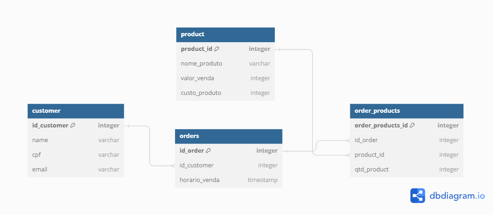

# Database Creation and Analysis Project

Este projeto em Python cria e gerencia um banco de dados relacional utilizando PostgreSQL. Ele inclui scripts para definir o esquema do banco de dados, popular com dados fictícios, e realizar análises utilizando consultas SQL. Tudo é coordenado por um único arquivo `main.py`, que deve ser executado para rodar o projeto.

## Arquivos do Projeto

- **`create_database_script.py`**: Script que cria o banco de dados relacional e define seu esquema usando SQLAlchemy.
- **`db_visual_schema.png`**: Esquema visual do banco de dados, detalhando as tabelas e suas relações.
- **`db_connection.py`**: Script que configura a conexão com o banco de dados PostgreSQL usando SQLAlchemy.
- **`populate_database.py`**: Script que utiliza a biblioteca Faker para gerar e inserir dados fictícios no banco de dados.
- **`profitable_products_query.sql`**: Consulta SQL para criar uma tabela com os produtos mais rentáveis.
- **`top_100_products_query.sql`**: Consulta SQL para criar uma tabela com os 100 produtos mais vendidos.
- **`intersection_top100_and_profitable_products.sql`**: Consulta SQL para criar uma tabela com a intersecção dos produtos mais rentáveis e os 100 mais vendidos.
- **`main.py`**: Arquivo principal que executa todas as etapas descritas acima. É o único arquivo que precisa ser executado para rodar o projeto.

## Pré-requisitos

- Python 3.7 ou superior
- PostgreSQL
- Bibliotecas Python: `SQLAlchemy`, `Faker`, `psycopg2` (ou `psycopg2-binary`)

## Instalação

1. Clone o repositório para sua máquina local:

   ```bash
   git clone hhttps://github.com/nalufuchs/database_generator
   cd database_generator
   ```

2. Crie um ambiente virtual e instale as dependências:

   ```bash
   python -m venv venv
   source venv/bin/activate  # No Windows: venv\Scripts\activate
   pip install -r requirements.txt
   ```

3. Configure o banco de dados PostgreSQL e ajuste as configurações de conexão no arquivo `db_connection.py`.

## Uso

1. **Rodar o projeto**:

   Execute o arquivo `main.py` para rodar todo o pipeline:

   ```bash
   python main.py
   ```

   O script `main.py` realizará as seguintes ações:

   - Criará o banco de dados e suas tabelas.
   - Populá-lo-á com dados fictícios.
   - Executará as consultas SQL para gerar as tabelas de análise.

   **Exemplo**:

   No arquivo `main.py`, você pode personalizar o número de clientes, produtos e pedidos criados, alterando os parâmetros na função `create_customers`, `create_products`, e `create_orders`. Aqui está um exemplo de como esses parâmetros podem ser configurados:

   ```python
   if __name__ == '__main__':
       customers = ppd.create_customers(1000)  # Cria 1000 clientes
       products = ppd.create_products(500)  # Cria 500 produtos
       orders = ppd.create_orders(customers, 5)  # Cada cliente faz 5 pedidos
       ppd.create_order_products(orders, products, 5)  # Cada pedido tem 5 produtos
       print('Clientes inseridos com sucesso!')
       queries = sq.process_tables()  # Executa as consultas SQL para gerar as tabelas de análise
   ```

   Esses parâmetros podem ser ajustados conforme necessário para simular diferentes cenários.

## Esquema Visual do Banco de Dados

O diagrama abaixo representa o esquema do banco de dados criado:



## Contribuições

Contribuições são bem-vindas! Sinta-se à vontade para abrir uma _issue_ ou enviar um _pull request_.
