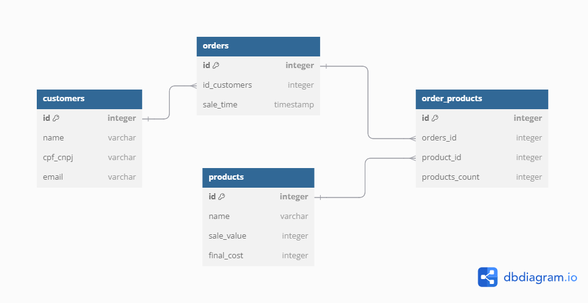

# Database Creation and Analysis Project

This Python project creates and manages a relational database using PostgreSQL. It includes scripts to define the database schema, populate it with fake data, and perform analyses using SQL queries. Everything is coordinated by three main files, such as:  `database_setup.py`, `data_population.py` and `etl_process`, which must be run in this order to execute the project.

## Project Structure

### Directories:

1. **`database/`**: Contains the scripts related to the database creation and connection.
   - **`create_database.py`**: Defines the database schema using SQLAlchemy.
   - **`db_connection.py`**: Configures the connection to the PostgreSQL database using SQLAlchemy.
   - **`populate_database.py`**: Uses the Faker library to generate and insert fake data into the database.
   
2. **`documents/`**: Contains visual documentation and dependency files.
   - **`database_diagram.png`**: Visual representation of the database schema.
   - **`requirements.txt`**: List of Python dependencies.

3. **`ETLs/`**: Contains SQL scripts and a pipeline to perform ETL processes on the database.
   - **`pipeline.py`**: Runs the SQL scripts.
   - **`SQLqueries/`**: Directory with the SQL queries.
     - **`profitable_products_query.sql`**: SQL query to create a table with the most profitable products.
     - **`top_100_products_query.sql`**: SQL query to create a table with the top 100 best-selling products.
     - **`intersection_top100_and_profitable_products.sql`**: SQL query to create a table with the intersection of the most profitable and top 100 best-selling products.

### Main Files:

1. **`database_setup.py`**: Creates the connection to the database.
2. **`data_population.py`**: Uses the function from `populate_database.py` to define the number of rows to populate in the database.
3. **`etl_process.py`**: Processes the ETLs in the `SQLqueries` directory, creating new analysis tables.

## Prerequisites

- Python 3.7 or higher
- PostgreSQL
- Python libraries: `SQLAlchemy`, `Faker`, `psycopg2` (or `psycopg2-binary`)

## Installation

1. Clone the repository to your local machine:

   ```bash
   git clone https://github.com/nalufuchs/database_generator
   cd database_generator
   ```

2. Create a virtual environment and install the dependencies:

   ```bash
   python -m venv venv
   source venv/bin/activate  # On Windows: venv\Scripts\activate
   cd documents
   pip install -r requirements.txt
   ```

3. Set up the PostgreSQL database and adjust the connection settings in the `database/db_connection.py` file by adding your database credentials.

## Usage

1. **Create the Database**:

   Run the `database_setup.py` file to create the database.
   ```bash
   python database_setup.py
   ```
   This file will validate the presence of pre-existing tables, and if none are found, it will create the necessary tables in the configured database.

2. **Populate the Database**:

   Run the `data_population.py` file to insert fake data into the database.
   ```bash
   python data_population.py
   ```
   You can customize the number of customers, products, and orders created by adjusting the parameters in the `create_customers`, `create_products`, and `create_orders` functions.

   It will check if the tables have already been populated. If not, values will be inserted according to the user's requirements, and these parameters can be adjusted to simulate different scenarios.

3. **Execute the ETL**:

   Run the `etl_process.py` file to execute the SQL queries and generate the analysis tables.
   ```bash
   python etl_process.py
   ```
   This file will generate SQL queries and create new tables in the database, checking if the table already exists and, if not, creating new analysis tables.

4. **Run the entire pipeline**:

   Run the scripts in the following order:
   1. `database_setup.py`
   2. `data_population.py`
   3. `etl_process.py`

   Following this order, the complete process will be executed:

   - Creates the database and its tables.
   - Inserts fake data.
   - Executes SQL queries and creates the analysis tables.

## Database Schema Visual

The diagram below represents the schema of the created database:



## Contributions

Contributions are welcome! Feel free to open an issue or submit a pull request.